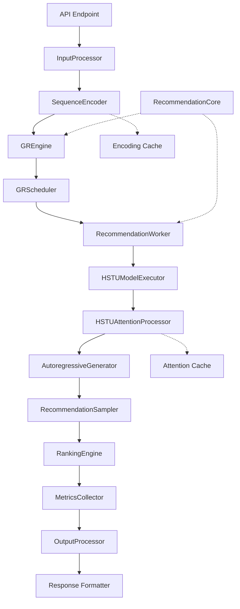
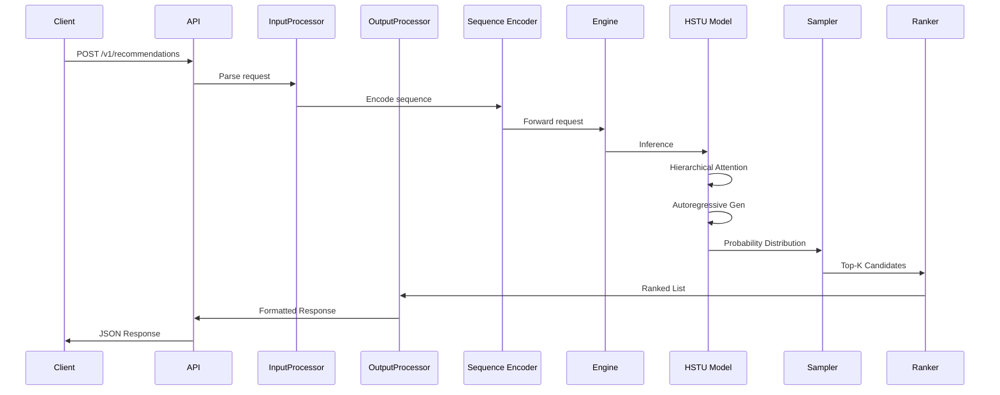

# Architecture Design Document
## vllm-gr: High-Throughput Serving Plugin for HSTU Generative Recommendation Models

**Version**: 1.0  
**Status**: Draft

---

## 1. Overview

This document describes the architecture design for vllm-gr, a vLLM inference plugin that enables high-throughput serving of HSTU (Hierarchical Sequential Transduction Unit) generative recommendation models.

### 1.1 Design Goals
- **Performance**: Leverage vLLM's PagedAttention and continuous batching for 10x+ throughput improvement
- **Compatibility**: Seamless integration with vLLM v1 plugin system
- **Modularity**: Clear separation of concerns aligned with vLLM v1 structure
- **Extensibility**: Support for future recommendation model architectures

### 1.2 Architecture Principles
- **Alignment with vLLM v1**: Mirror vLLM's directory structure for seamless integration
- **Plugin-Based**: Follow vLLM's plugin system architecture
- **Efficiency First**: Optimize for high-throughput, low-latency serving
- **HSTU-Optimized**: Specialized optimizations for HSTU architecture characteristics

---

## 2. System Architecture

### 2.1 High-Level Architecture

The plugin integrates with vLLM's v1 engine across multiple layers:

```
┌─────────────────────────────────────────────────────────────┐
│                     Client Applications                      │
└──────────────────────┬──────────────────────────────────────┘
                       │
                       │ OpenAI-compatible API + Extensions
                       │
┌──────────────────────▼──────────────────────────────────────┐
│              vllm-gr Entry Points                            │
│  ┌──────────────┐  ┌──────────────┐  ┌──────────────┐      │
│  │  CLI (cli.py)│  │ API Server  │  │  Offline     │      │
│  │              │  │(api_server) │  │  (gr.py)     │      │
│  └──────────────┘  └──────────────┘  └──────────────┘      │
└──────────────────────┬──────────────────────────────────────┘
                       │
┌──────────────────────▼──────────────────────────────────────┐
│                  vllm-gr API Layer                          │
│  ┌──────────────────────────────────────────────────────┐  │
│  │ /v1/recommendations endpoint                         │  │
│  │ /v1/metrics endpoint                                 │  │
│  │ /v1/completions (OpenAI-compatible)                  │  │
│  └──────────────────────────────────────────────────────┘  │
└──────────────────────┬──────────────────────────────────────┘
                       │
┌──────────────────────▼──────────────────────────────────────┐
│              vLLM v1 Engine Integration                     │
│  ┌──────────────┐  ┌──────────────┐  ┌──────────────┐    │
│  │   Engine     │  │   Scheduler  │  │   Worker     │    │
│  └──────────────┘  └──────────────┘  └──────────────┘    │
└──────────────────────┬──────────────────────────────────────┘
                       │
┌──────────────────────▼──────────────────────────────────────┐
│                  vllm-gr Components                         │
│  ┌──────────────┐  ┌──────────────┐  ┌──────────────┐    │
│  │    Engine    │  │   Scheduler  │  │    Worker    │    │
│  └──────────────┘  └──────────────┘  └──────────────┘    │
│  ┌──────────────┐  ┌──────────────┐  ┌──────────────┐    │
│  │Cache Manager │  │   Attention  │  │   Sample     │    │
│  └──────────────┘  └──────────────┘  └──────────────┘    │
└──────────────────────┬──────────────────────────────────────┘
                       │
┌──────────────────────▼──────────────────────────────────────┐
│              GR Model (via Model Executor)                  │
│  ┌──────────────────────────────────────────────────────┐   │
│  │ Hierarchical Self-Attention + Autoregressive Output  │   │
│  └──────────────────────────────────────────────────────┘   │
└─────────────────────────────────────────────────────────────┘
```

### 2.2 Directory Structure (Aligned with vLLM v1)

```
vllm_gr/
├── __init__.py
├── attention/              # Attention mechanisms for HSTU
│   ├── __init__.py
│   ├── hstu_attention.py   # Hierarchical self-attention implementation
│   └── base.py
├── core/                   # Core functionality
│   ├── __init__.py
│   ├── sched               # request level scheduling
│       ├── __init__.py
│       └── gr_scheduler.py # GRScheduler (inherits from vLLMSc)
│   └── kv_cache_manager.py # 
├── entrypoint/             # Entry points (aligned with vllm/entrypoints/)
│   ├── __init__.py
│   ├── cli.py              # CLI commands (serve, bench, etc.)
│   ├── api_server.py       # Online serving API server
│   ├── gr.py               # Offline serving interface
├── engine/                 # Engine components (vllm/v1/engine aligned)
│   ├── __init__.py
│   ├── gr_engine.py        # GREngine (inherits from vLLM's LLMEngine)
│   ├── input_processor.py  # Input processing for recommendation requests
│   ├── output_processor.py # output processing for gr requests
├── model_executor/         # Model execution (vllm/v1/model_executor aligned)
│   ├── __init__.py
│   ├── model_executor.py
│   ├── model_loader.py
│   └── models/
│       ├── __init__.py
│       └── hstu.py
├── sample/                 # Sampling strategies
│   ├── __init__.py
│   ├── beam_search_sampler.py
│   └── topk_sampler.py
├── utils/                  # Utilities (vllm/v1/utils aligned)
│   ├── __init__.py
│   ├── ranking_engine.py
│   ├── metrics_collector.py
│   └── batch_processor.py
└── worker/                 # Worker (vllm/v1/worker aligned)
    ├── __init__.py
    └── gpu_worker.py
    └── gpu_model_runner.py    
```

### 2.3 Integration Points with vLLM v1

The plugin integrates with vLLM's v1 engine through:

1. **CLI Entry Points** (via `entrypoint/cli.py`): Command-line interface for serving, benchmarking, and batch processing
2. **API Server** (via `entrypoint/api_server.py`): Online serving with OpenAI-compatible API + recommendation endpoints
3. **Offline Interface** (via `entrypoint/gr.py`): Direct Python interface for batch processing
4. **Engine Extensions**: Custom engine (GREngine) inheriting from vLLM's LLMEngine for HSTU workloads
5. **Scheduler Extensions**: Custom scheduler (GRScheduler in `core/sched/`) inheriting from vLLM's Scheduler for recommendation request-level scheduling
6. **IO Processor** (via `engine/input_processor.py` and `engine/output_processor.py`): Input/output transformation for recommendation-specific data (part of engine)
7. **Model Executor**: HSTU-specific model execution logic
8. **Worker Extensions**: Recommendation-specific worker implementations

---

## 3. Core Components

### 3.1 Entry Point (`vllm_gr/entrypoint/`)

**Purpose**: Entry points for online/offline serving, CLI, and API server (aligned with `vllm/entrypoints/`)

**Components**:

- **`cli.py`**: Command-line interface entry points
  - `vllm-gr serve`: Start OpenAI-compatible API server for online serving
  - `vllm-gr bench`: Benchmark HSTU model performance
  - `vllm-gr run-batch`: Execute batch inference tasks
  - `vllm-gr recommend`: Generate recommendations via CLI
  - Follows vLLM's CLI pattern (`vllm serve`, `vllm bench`, etc.)

- **`api_server.py`**: Online serving API server
  - OpenAI-compatible API server for recommendation models
  - Extends vLLM's API server with `/v1/recommendations` endpoint
  - Handles HTTP requests for real-time recommendation serving
  - Supports `/v1/completions` and `/v1/chat/completions` for compatibility
  - Custom `/v1/recommendations` endpoint for recommendation-specific requests

- **`gr.py`**: Offline serving interface
  - Direct Python interface for batch processing without server
  - `GRLLM` class (inherits from vLLM's `LLM` class)
  - Extends vLLM's `LLM` with recommendation-specific functionality
  - Enables programmatic access for offline inference
  - Supports batch processing of recommendation requests

**Integration**: 
- CLI commands via `pyproject.toml` entry points (e.g., `[project.scripts]`)
- Plugin registration via `pyproject.toml` entry points
- API server extends vLLM's existing API server infrastructure

### 3.2 Engine (`vllm_gr/engine/`)

**Purpose**: Core inference engine components aligned with `vllm/v1/engine`

**Components**:
- **`GREngine`**: Core inference engine managing request handling, scheduling, and execution
  - Inherits from vLLM's `LLMEngine` class
  - Extends vLLM's engine for recommendation workloads
  - Handles recommendation-specific request routing
  - Manages recommendation context and session state
  - Provides all standard LLMEngine functionality plus recommendation-specific features

- **`InputProcessor`** (`engine/input_processor.py`): Input processing for recommendation requests
  - Handles heterogeneous user interaction sequences
  - User interaction sequence encoding
  - Item metadata embedding
  - Context preparation
  - Request parsing and validation

- **`OutputProcessor`** (`engine/output_processor.py`): Output processing for recommendation requests
  - Autoregressive output parsing
  - Probability distribution extraction
  - Item ID prediction
  - Response formatting
  - Metadata attachment

**Integration**: Inherits from `vllm.engine.llm_engine.LLMEngine` (or `vllm.v1.engine.LLMEngine` in v1)

**Implementation Example**:
```python
from vllm.engine.llm_engine import LLMEngine

class GREngine(LLMEngine):
    """GR Engine inherits from vLLM's LLMEngine"""
    def __init__(self, vllm_config, executor_class, log_stats, 
                 usage_context=UsageContext.ENGINE_CONTEXT, 
                 stat_loggers=None, **kwargs):
        super().__init__(vllm_config, executor_class, log_stats, 
                        usage_context, stat_loggers, **kwargs)
        # Additional initialization for recommendation workloads
        self._initialize_recommendation_features()
    
    def _initialize_recommendation_features(self):
        """Initialize recommendation-specific features"""
        # Recommendation context management
        # Session state handling
        pass
```

### 3.3 Model Executor (`vllm_gr/model_executor/`)

**Purpose**: Model execution logic aligned with `vllm/v1/model_executor`

**Components**:
- **`HSTUModelExecutor`**: Model execution logic for HSTU architecture
  - Manages forward pass for HSTU models
  - Handles hierarchical attention computation
  - Implements autoregressive generation

- **`HSTUModelLoader`**: Model loading mechanism compatible with vLLM's processes
  - Loads HSTU models from HuggingFace format
  - Converts HSTU architecture to vLLM-compatible format
  - Handles model configuration and initialization

- **`models/hstu.py`**: HSTU model implementation
  - Hierarchical self-attention layers
  - Pointwise attention mechanisms
  - Gated transformation layers
  - Learnable positional biases
  - Autoregressive output head

**Integration**: Extends `vllm.v1.model_executor.BaseModelExecutor`

### 3.4 Attention (`vllm_gr/attention/`)

**Purpose**: HSTU-specific attention mechanisms

**Components**:
- **`HSTUAttentionProcessor`**: Implements hierarchical self-attention
  - Pointwise attention computation
  - Hierarchical attention layers
  - Efficient attention caching

- **`HierarchicalAttention`**: Core hierarchical attention mechanism
  - Multi-level attention aggregation
  - Gated transformation layers
  - Learnable positional bias application

**Integration**: Integrates with vLLM's PagedAttention for efficient memory management

### 3.5 Core (`vllm_gr/core/`)

**Purpose**: Core recommendation inference functionality

**Components**:
- **`SequenceEncoder`**: Efficient encoding of variable-length, heterogeneous user histories
  - Sequence padding and truncation
  - Encoding computation amortization
  - Metadata embedding

- **`RecommendationCore`**: Core recommendation logic
  - Recommendation pipeline orchestration
  - Context management
  - Session state handling

- **`sched/GRScheduler`** (`core/sched/gr_scheduler.py`): Request-level scheduler optimized for HSTU inference patterns
  - Inherits from vLLM's `Scheduler` class
  - Variable-length sequence batching optimization
  - Continuous batching for recommendation requests
  - Priority queue management for real-time vs batch requests
  - Request-level scheduling optimization for recommendation workloads
  - Extends vLLM's scheduler with recommendation-specific scheduling logic

- **`KVCacheManager`** (`core/kv_cache_manager.py`): KV cache management for recommendation sequences
  - Efficient KV cache allocation for variable-length sequences
  - Paged KV cache management
  - Cache compression for long sequences
  - Memory optimization for high-cardinality item spaces

**Integration**: GRScheduler inherits from vLLM's `Scheduler` class (from `vllm.v1.scheduler` or `vllm.scheduler`)

**Implementation Example for GRScheduler**:
```python
from vllm.v1.scheduler import Scheduler

class GRScheduler(Scheduler):
    """GR Scheduler inherits from vLLM's Scheduler"""
    def __init__(self, scheduler_config, cache_config, **kwargs):
        super().__init__(scheduler_config, cache_config, **kwargs)
        # Additional initialization for recommendation workloads
        self._initialize_recommendation_scheduling()
    
    def _initialize_recommendation_scheduling(self):
        """Initialize recommendation-specific scheduling features"""
        # Variable-length sequence batching optimization
        # Priority queue management for recommendation requests
        pass
```

### 3.6 Sample (`vllm_gr/sample/`)

**Purpose**: Sampling strategies for recommendation generation

**Components**:
- **`RecommendationSampler`**: Base sampling strategy interface for generating candidates
  - Abstract base class for all sampling strategies
  - Defines interface for sampling from next-item probability distributions
  - Common utilities for candidate selection

- **`TopKSampler`**: Top-K sampling for recommendation generation
  - Efficient top-K selection from probability distributions
  - Greedy selection of top-K items based on probability scores
  - Configurable K values
  - Batch-optimized sampling
  - Fast implementation for real-time serving

- **`BeamSearchSampler`**: Beam search sampling for recommendation generation
  - Maintains multiple candidate sequences (beams) during generation
  - Explores diverse recommendation paths simultaneously
  - Better coverage of recommendation space compared to greedy top-K
  - Configurable beam width (number of beams to maintain)
  - Beam pruning and expansion strategies
  - Handles variable-length recommendation sequences
  - Useful for generating diverse, high-quality recommendation lists
  - Supports length normalization for fair comparison across beams
  - Integration with autoregressive generation pipeline

**Integration**: Extends vLLM's sampling engine and integrates with autoregressive generation

### 3.7 Worker (`vllm_gr/worker/`)

**Purpose**: Worker functionalities aligned with `vllm/v1/worker`

**Components**:
- **`RecommendationWorker`**: Worker handling inference tasks
  - Integrates with vLLM's core engine
  - Handles recommendation-specific worker logic
  - Manages GPU memory for recommendation workloads

**Integration**: Extends `vllm.v1.worker.WorkerBase`

### 3.8 Utils (`vllm_gr/utils/`)

**Purpose**: Utility functions aligned with `vllm/v1/utils`

**Components**:
- **`RankingEngine`**: Post-processing ranking and reranking
  - Score normalization
  - Diversity enforcement
  - Business rule filtering

- **`MetricsCollector`**: Tracks recommendation quality metrics
  - NDCG calculation
  - MRR calculation
  - Hit Rate calculation
  - Latency and throughput tracking

- **`BatchProcessor`**: Handles batch inference requests
  - Batch formation for variable-length sequences
  - Result aggregation
  - Metrics calculation for batches

---

## 4. Data Flow

### 4.1 Request Flow

```
Client Request
    │
    ▼
API Endpoint (/v1/recommendations)
    │
    ▼
InputProcessor (vllm_gr/engine/)
    │ • Parse request
    │ • Extract user sequence
    │ • Prepare context
    │
    ▼
SequenceEncoder (vllm_gr/core/)
    │ • Encode user history
    │ • Apply amortization
    │ • Embed metadata
    │
    ▼
GREngine (vllm_gr/engine/)
    │ • Route request
    │ • Manage context
    │
    ▼
GRScheduler (vllm_gr/core/sched/)
    │ • Batch requests
    │ • Optimize sequence grouping
    │ • Request-level scheduling
    │
    ▼
RecommendationWorker (vllm_gr/worker/)
    │ • Prepare GPU memory
    │ • Manage execution
    │
    ▼
HSTUModelExecutor (vllm_gr/model_executor/)
    │ • Forward pass
    │ • Hierarchical attention
    │
    ▼
HSTUAttentionProcessor (vllm_gr/attention/)
    │ • Compute hierarchical attention
    │ • Apply pointwise attention
    │ • Gated transformations
    │
    ▼
Autoregressive Generator
    │ • Generate next-item probabilities
    │
    ▼
RecommendationSampler (vllm_gr/sample/)
    │ • Sample candidates (Top-K or Beam Search)
    │ • Extract probability scores
    │ • Generate diverse recommendation sequences
    │
    ▼
RankingEngine (vllm_gr/utils/)
    │ • Rank candidates
    │ • Apply business rules
    │
    ▼
OutputProcessor (vllm_gr/engine/)
    │ • Format recommendations
    │ • Add metadata
    │ • Finalize response
    │
    ▼
Client Response
```

### 4.2 Input Format

```json
{
  "user_id": "user_12345",
  "sequence": [
    {"item_id": "item_001", "timestamp": 1640995200, "metadata": {...}},
    {"item_id": "item_002", "timestamp": 1640995300, "metadata": {...}},
    ...
  ],
  "context": {
    "session_id": "session_abc",
    "user_profile": {...}
  },
  "top_k": 10,
  "sampling_strategy": "beam_search",  # or "top_k"
  "beam_width": 5,  # For beam search
  "diversity": 0.5
}
```

### 4.3 Output Format

```json
{
  "recommendations": [
    {"item_id": "item_123", "score": 0.95, "metadata": {...}},
    {"item_id": "item_456", "score": 0.87, "metadata": {...}},
    ...
  ],
  "metrics": {
    "latency_ms": 85,
    "sequence_length": 150,
    "num_candidates_generated": 1000
  }
}
```

---

## 5. Plugin Integration

### 5.1 Entry Point Configuration

The plugin registers with vLLM v1 via `pyproject.toml`:

**CLI Entry Points** (for command-line usage):
```toml
[project.scripts]
vllm-gr = "vllm_gr.entrypoint.cli:main"
vllm-gr-serve = "vllm_gr.entrypoint.cli:serve"
vllm-gr-bench = "vllm_gr.entrypoint.cli:bench"
vllm-gr-run-batch = "vllm_gr.entrypoint.cli:run_batch"
vllm-gr-recommend = "vllm_gr.entrypoint.cli:recommend"
```

**Plugin Registration** (for vLLM plugin system):
```toml
[project.entry-points."vllm.general_plugins"]
vllm-gr = "vllm_gr.entrypoint:register_plugin"

[project.entry-points."vllm.io_processor_plugins"]
hstu = "vllm_gr.engine.input_processor:HSTUInputProcessorPlugin"

[project.entry-points."vllm.model_executor_plugins"]
hstu = "vllm_gr.model_executor.hstu_model_executor:HSTUModelExecutor"
```

### 5.2 CLI Usage Examples

**Online Serving** (API Server):
```bash
# Start API server for online serving
vllm-gr serve hstu-model --port 8100 --host 0.0.0.0

# Or use vllm serve with plugin
vllm serve hstu-model --port 8100 --plugins vllm-gr
```

**Offline Serving** (Python Interface):
```python
from vllm_gr.entrypoint.gr import GRLLM

# Initialize for offline inference (inherits from vLLM's LLM)
llm = GRLLM(model="hstu-model")

# Generate recommendations
recommendations = llm.recommend(
    user_id="user_123",
    sequence=[...],
    top_k=10,
    sampling_strategy="beam_search",  # or "top_k"
    beam_width=5  # For beam search
)

# Can also use standard vLLM LLM methods
# llm.generate(...)  # Inherited from vLLM's LLM class
```

**CLI Commands**:
```bash
# Benchmark model performance
vllm-gr bench hstu-model --num-prompts 1000

# Run batch inference
vllm-gr run-batch --input-file data.jsonl --output-file results.jsonl

# Generate recommendations via CLI
vllm-gr recommend --user-id user_123 --sequence-file sequence.json
```

### 5.2 Model Registration

HSTU models are registered directly in the model executor module:

```python
# Model registration handled in model_executor module
# No separate registry file needed in entrypoint
```

### 5.3 Configuration

Plugin-specific configuration via vLLM's EngineArgs:

```python
from vllm import EngineArgs

engine_args = EngineArgs(
    model="hstu-model",
    plugin_config={
        "hstu": {
            "max_sequence_length": 10000,
            "sampling_strategy": "beam_search",  # or "top_k"
            "top_k": 10,  # For TopKSampler
            "beam_width": 5,  # For BeamSearchSampler
            "enable_amortization": True,
            "attention_cache_size": 1024
        }
    }
)
```

---

## 6. Performance Considerations

### 6.1 Fast Attention Optimization

**PagedAttention Integration**:
- Leverage vLLM's PagedAttention for efficient handling of long sequences
- Hierarchical attention layers utilize PagedAttention's block-sparse attention
- Efficient KV cache management for variable-length sequences

**Implementation Strategy**:
- Map HSTU's hierarchical attention to PagedAttention blocks
- Optimize attention computation for pointwise operations
- Cache frequently accessed attention patterns

### 6.2 Continuous Batching

**Batching Strategy**:
- Utilize vLLM's continuous batching engine
- Optimize batch composition for variable-length sequences
- Group sequences by similar length for efficiency

**Sequence Grouping**:
- Group sequences with similar lengths together
- Use dynamic padding strategies
- Minimize padding overhead

### 6.3 Encoding Amortization

**Computation Reuse**:
- Cache encoded representations for common sequence prefixes
- Reuse computations across similar user histories
- Implement incremental encoding for sequence updates

**Memory Management**:
- Efficient storage of encoded representations
- LRU cache for frequently accessed encodings
- Memory-aware cache eviction policies

### 6.4 Memory Management

**KV Cache Optimization**:
- Efficient KV cache allocation for variable-length sequences
- Paged KV cache management
- Cache compression for long sequences

**High-Cardinality Item Spaces**:
- Efficient item embedding storage
- Shared embeddings where possible
- Quantization for large embedding tables

### 6.5 Caching Strategies

**Attention Cache**:
- Cache hierarchical attention patterns
- Reuse attention computations for similar sequences
- Session-based attention caching

**Sequence Cache**:
- Cache encoded user histories
- Incremental updates for sequence extensions
- User-specific cache management

---

## 7. HSTU-Specific Optimizations

### 7.1 Hierarchical Attention Mapping

**Attention Layer Mapping**:
- Map HSTU's hierarchical attention to vLLM's attention layers
- Optimize pointwise attention operations
- Efficient gated transformation computation

**Positional Bias Handling**:
- Efficient application of learnable positional biases
- Cache positional embeddings
- Optimize bias computation for long sequences

### 7.2 Autoregressive Generation

**Generation Strategy**:
- Efficient autoregressive generation for next-item prediction
- Optimize probability distribution computation
- Batch-optimized generation

**Output Processing**:
- Efficient extraction of next-item probabilities
- Top-K selection optimization (greedy)
- Beam search optimization (diverse exploration)
- Probability normalization
- Beam pruning and expansion strategies

### 7.3 Sequence Encoding Optimization

**Amortization Implementation**:
- Incremental encoding for sequence updates
- Prefix caching for common sequence starts
- Efficient encoding computation reuse

**Metadata Embedding**:
- Efficient handling of heterogeneous metadata
- Shared embedding spaces where possible
- Optimized metadata encoding

---

## 8. Testing Strategy

### 8.1 Unit Tests

**Component Testing**:
- Test each component in isolation
- Mock dependencies for clean testing
- Test edge cases and error handling

**Coverage Targets**:
- >80% code coverage
- Critical paths: 100% coverage
- Error paths: 90% coverage

### 8.2 Integration Tests

**vLLM Integration**:
- Test plugin registration and discovery
- Test model loading and execution
- Test end-to-end inference pipeline

**Performance Tests**:
- Latency benchmarks
- Throughput benchmarks
- Memory usage tests

### 8.3 Recommendation Quality Tests

**Metrics Validation**:
- NDCG calculation accuracy
- MRR calculation accuracy
- Hit Rate calculation accuracy

**Quality Comparison**:
- Compare against baseline HSTU implementations
- Validate recommendation quality parity
- Test on standard datasets (Amazon, MovieLens, etc.)

---

## 9. Diagrams

### 9.1 Component Interaction Diagram



### 9.2 Data Flow Diagram



---

## 10. References

- [vLLM v1 Structure](https://github.com/vllm-project/vllm/tree/main/vllm/v1)
- [vLLM Plugin System Documentation](https://docs.vllm.ai/en/latest/design/plugin_system.html)
- [HSTU Paper: Hierarchical Sequential Transduction Unit](https://arxiv.org/abs/2402.17152)
- [vLLM PagedAttention](https://docs.vllm.ai/en/latest/technical_notes/attention.html)
- [vLLM Continuous Batching](https://docs.vllm.ai/en/latest/technical_notes/batching.html)
